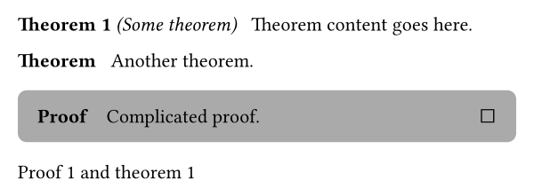
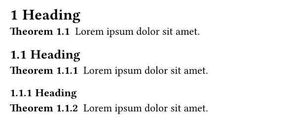
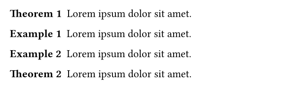
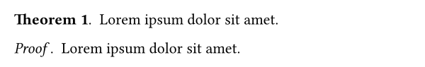
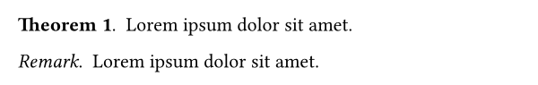
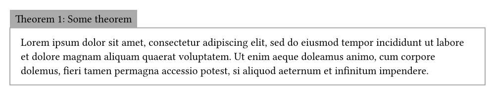
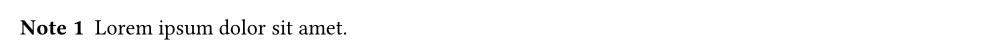

# lemmify

Lemmify is a library for typesetting mathematical
theorems in typst. It aims to be easy to use while
trying to be as flexible and idiomatic as possible.
This means that the interface might change with updates to typst
(for example if user-defined element functions are introduced).
But no functionality should be lost.

If you are encountering any bugs, have questions or are missing
features, feel free to open an issue on
[GitHub](https://github.com/Marmare314/lemmify).

## Basic usage

1. Import lemmify:

```typst
#import "@preview/lemmify:0.2.0": default-theorems, select-kind

```

2. Generate some common theorem kinds with pre-defined style:

```typst
#let (
  theorem, lemma, corollary,
  remark, proposition, example,
  proof, theorem-rules
) = default-theorems(lang: "en")
```

3. Apply the generated style:

```typst
#show: theorem-rules
```

4. Customize the theorems using show rules. For example, to add a block around proofs:

```typst
#show select-kind(proof): block.with(
  breakable: true,
  width: 100%,
  fill: gray,
  inset: 1em,
  radius: 5pt
)
```

5. Create theorems, lemmas, and proofs:

```typst
#theorem(name: "Some theorem")[
  Theorem content goes here.
]<thm>

#theorem(numbering: none)[
  Another theorem.
]

#proof(link-to: <thm>)[
  Complicated proof.
]<proof>

@proof and @thm[theorem]
```

The result should now look something like this:



## Examples

By default theorems are reset on every heading. This can be changed with the
`max-reset-level`
parameter of
`default-theorems()`. This also
changes which heading levels will be used in the numbering. To not reset them
at all
`max-reset-level`
can be set to 0.

```typst
#import "@preview/lemmify:0.2.0": default-theorems

#let (
  theorem, theorem-rules
) = default-theorems(max-reset-level: 2)
#show: theorem-rules
#set heading(numbering: "1.1")

= Heading
#theorem(lorem(5))
== Heading
#theorem(lorem(5))
=== Heading
#theorem(lorem(5))
```



Each theorem belongs to a group and every group shares one counter. The theorems created
by
`default-theorems()`
all belong to the same group, except for proofs.
You can create seperate groups by passing a group parameter to
`default-theorems()`.
The next example shows how to create seperately numbered examples.

```typst
#import "@preview/lemmify:0.2.0": default-theorems

#let (theorem, theorem-rules) = default-theorems()
#show: theorem-rules
#let (
  example, theorem-rules
) = default-theorems(group: "example-group")
#show: theorem-rules

#theorem(lorem(5))
#example(lorem(5))
#example(lorem(5))
#theorem(lorem(5))
```



The link-to parameter can be used to link theorems to other content. By default
theorems are linked to the last heading and proofs are linked to the last theorem.
This example shows how corallaries can be linked to the last theorem.
Note that it's fine to only apply the
`theorem-rules`
once here since both theorem-kinds belong to the same group.

```typst
#import "@preview/lemmify:0.2.0": default-theorems, select-kind, reset-counter

#let (theorem, theorem-rules) = default-theorems()
#let (corollary,) = default-theorems(
  group: "corollary-group",
  link-to: select-kind(theorem)
)
#show: theorem-rules
#show select-kind(theorem): it => {it; reset-counter(corollary)}

#theorem(lorem(5))
#corollary(lorem(5))
#corollary(lorem(5))
#theorem(lorem(5))
#corollary(lorem(5))
```


The best and easiest way to change the look of theorems is to use show-rules.
The next example shows another way how the appearance of theorems can be changed.

```typst
#import "@preview/lemmify:0.2.0": default-theorems, style-simple

#let (
  theorem, proof, theorem-rules
) = default-theorems(
  lang: "en",
  style: style-simple.with(seperator: ".  "),
  proof-style: style-simple.with(kind-name-style: emph, seperator: ".  ")
)
#show: theorem-rules

#theorem(lorem(5))
#proof(lorem(5))
```



Doing the same thing to remarks is a bit more complicated since the style parameter applies to both theorems and remarks.

```typst
#import "@preview/lemmify:0.2.0": default-theorems, style-simple

#let (
  theorem, theorem-rules
) = default-theorems(
  lang: "en",
  style: style-simple.with(seperator: ".  ")
)
#let (remark,) = default-theorems(
  style: style-simple.with(kind-name-style: emph, seperator: ".  "),
  numbering: none
)
#show: theorem-rules

#theorem(lorem(5))
#remark(lorem(5))
```



If the pre-defined styles are not customizable enough you can also provide your own style.

```typst
#import "@preview/lemmify:0.2.0": default-theorems, get-theorem-parameters

#let custom-style(thm) = {
  let params = get-theorem-parameters(thm)
  let number = (params.numbering)(thm, false)
  block(
    inset: .5em,
    fill: gray,
    {
      params.kind-name + " "
      number
      if params.name != none { ": " + params.name }
    }
  )
  v(0pt, weak: true)
  block(
    width: 100%,
    inset: 1em,
    stroke: gray + 1pt,
    params.body
  )
}

#let (
  theorem, theorem-rules
) = default-theorems(lang: "en", style: custom-style)
#show: theorem-rules

#theorem(name: "Some theorem")[
  #lorem(40)
]
```



There is one other way to create
`theorem-function`s:
the
`theorem-kind()`
function. It is used to create
the theorem-functions returned by
`default-theorems()`
so it behaves almost the same. The only difference is that there is no
`max-reset-level`
parameter and that no
`theorem-rules`
are returned.
A default rule which does not reset any theorem counters can be imported.

```typst
#import "@preview/lemmify:0.2.0": theorem-kind, theorem-rules

#let note = theorem-kind("Note")
#show: theorem-rules

#note(lorem(5))
```



For a full documentation of all functions check the [pdf-version](docs/readme.pdf) of this readme.
