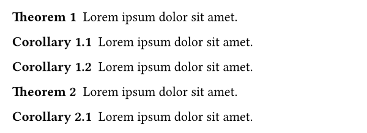
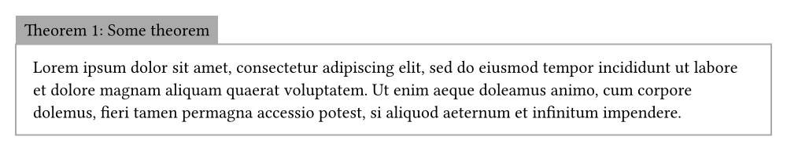

# lemmify

Lemmify is a library for typesetting mathematical
theorems in typst. It aims to be easy to use while
trying to be as flexible and idiomatic as possible.
This means that the interface might change with updates to typst
(for example if user-defined element functions are introduced).
But no functionality should be lost.

If you are encountering any bugs, have questions or are missing
features, feel free to open an issue on
[GitHub](https://github.com/Marmare314/lemmify).

## Basic usage

1. Import lemmify:

```typst
#import "@preview/lemmify:0.2.0": default-theorems, select-kind

```

2. Generate some common theorem kinds with pre-defined style:

```typst
#let (
  theorem, lemma, corollary,
  remark, proposition, example,
  proof, theorem-rules
) = default-theorems(lang: "en")
```

3. Apply the generated style:

```typst
#show: theorem-rules
```

4. Customize the theorems using show rules. For example, to add a block around proofs:

```typst
#show select-kind(proof): block.with(
  breakable: true,
  width: 100%,
  fill: gray,
  inset: 1em,
  radius: 5pt
)
```

5. Create theorems, lemmas, and proofs:

```typst
#theorem(name: "Some theorem")[
  Theorem content goes here.
]<thm>

#theorem(numbering: none)[
  Another theorem.
]

#proof(link-to: <thm>)[
  Complicated proof.
]<proof>

@proof and @thm[theorem]
```

The result should now look something like this:


## Examples

This example shows how corollaries can be numbered after the last theorem.

```typst
#import "@preview/lemmify:0.2.0": theorem-rules, theorem-kind, select-kind, reset-counter

#let theorem = theorem-kind("Theorem")
#let corollary = theorem-kind(
  "Corollary",
  group: "CorollaryGroup",
  link-to: select-kind(theorem)
)
#show: theorem-rules
#show select-kind(theorem): it => {it; reset-counter(corollary)}

#theorem(lorem(5))
#corollary(lorem(5))
#corollary(lorem(5))
#theorem(lorem(5))
#corollary(lorem(5))
```



If the pre-defined styles are not customizable enough you can also provide your own style.

```typst
#import "@preview/lemmify:0.2.0": default-theorems, get-theorem-parameters

#let custom-style(thm) = {
  let params = get-theorem-parameters(thm)
  let number = (params.numbering)(thm, false)
  block(
    inset: .5em,
    fill: gray,
    {
      params.kind-name + " "
      number
      if params.name != none { ": " + params.name }
    }
  )
  v(0pt, weak: true)
  block(
    width: 100%,
    inset: 1em,
    stroke: gray + 1pt,
    params.body
  )
}

#let (
  theorem, theorem-rules
) = default-theorems(lang: "en", style: custom-style)
#show: theorem-rules

#theorem(name: "Some theorem")[
  #lorem(40)
]
```



For a full documentation of all functions check [readme.pdf](docs/readme.pdf)
