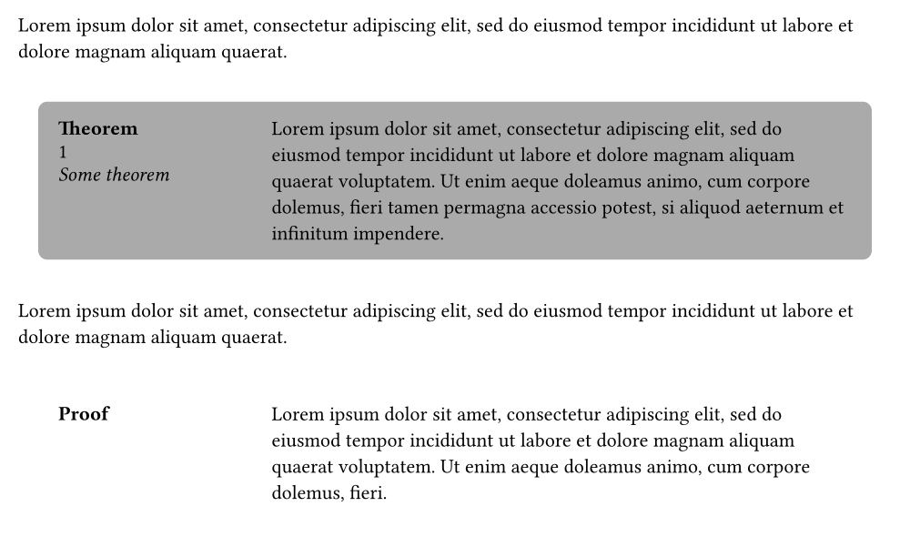

# Lemmify

Lemmify is a library for typesetting mathematical
theorems in typst. It aims to be easy to use while
trying to be as flexible and idiomatic as possible.
This means that the interface might change with updates to typst
(for example if user-defined element functions are introduced).
But no functionality should be lost.

## Basic usage

1. Import the Lemmify library
```typst
#import "@preview/lemmify:0.2.0": default-theorems, select-kind

```

2. Generate some common theorem kinds with pre-defined styling
```typst
#let (
  theorem, lemma, corollary,
  remark, proposition, example,
  proof, theorem-rules
) = default-theorems(lang: "en")
```

3. Apply the generated styling
```typst
#show: theorem-rules
```

4. Customize the styling using show rules. For example, to add a red box around proofs
```typst
#show select-kind(proof): box.with(stroke: red + 1pt, inset: 1em)
```

5. Create theorems, lemmas, and proofs
```typst
#theorem(name: "Some theorem")[
  Theorem content goes here.
]<thm>

#proof(link-to: <thm>)[
  Complicated proof.
]<proof>

@proof and @thm[theorem]
```

The result should now look something like this


## Examples

As another example we will number corollarys after the last theorem.
```typst
#import "@preview/lemmify:0.2.0": theorem-rules, theorem-kind, select-kind, reset-counter

#let theorem = theorem-kind("Theorem")
#let corollary = theorem-kind(
  "Corollary",
  group: "CorollaryGroup",
  link-to: select-kind(theorem)
)
#show: theorem-rules
#show select-kind(theorem): it => {it; reset-counter(corollary)}

#theorem(lorem(5))
#corollary(lorem(5))
#corollary(lorem(5))
#theorem(lorem(5))
#corollary(lorem(5))
```


## Custom style example

This examples shows how custom style functions can be defined.
```typst
#import "@preview/lemmify:0.2.0": default-theorems, get-theorem-parameters

#let my-style-func(thm, is-proof: false) = {
  let params = get-theorem-parameters(thm)
  let number = (params.numbering)(thm, false)
  let content = grid(
    columns: (1fr, 3fr),
    column-gutter: 1em,
    stack(spacing: .5em, strong(params.kind-name), number, emph(params.name)),
    params.body
  )

  if is-proof {
    block(inset: 2em, content)
  } else {
    block(inset: 1em, block(fill: gray, inset: 1em, radius: 5pt, content))
  }
}

#let my-style = (
  style: my-style-func,
  proof-style: my-style-func.with(is-proof: true)
)

#let (
  theorem, proof, theorem-rules
) = default-theorems(lang: "en", ..my-style)
#show: theorem-rules

#lorem(20)
#theorem(name: "Some theorem")[
  #lorem(40)
]
#lorem(20)
#proof[
  #lorem(30)
]
```



